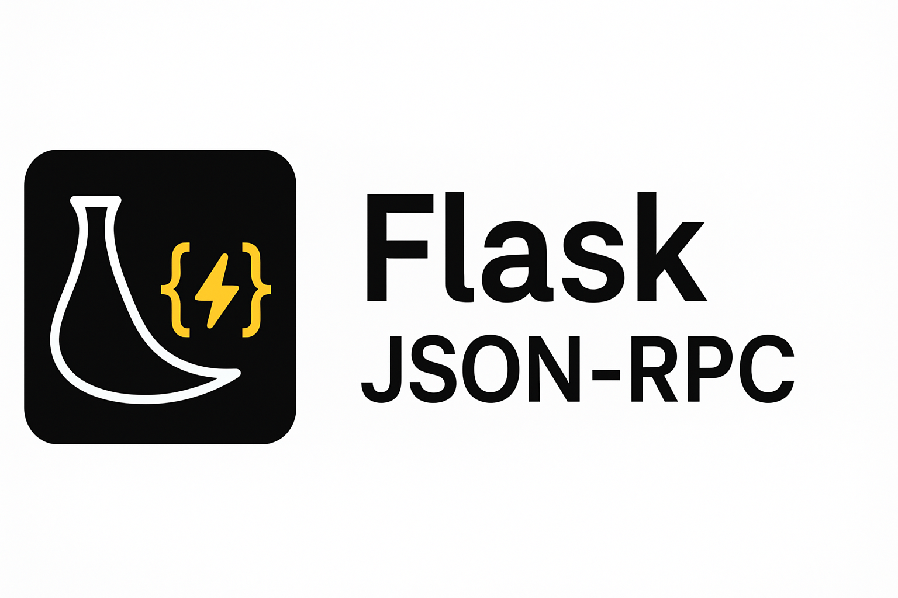

.. rst-class:: hide-header

Welcome to Flask-JSONRPC's documentation!
=========================================

Flask-JSONRPC brings full **JSON-RPC 2.0** support to your Flask applications.
It is designed to feel natural to anyone who already knows Flask, and easy to
learn for those who do not.

Flask-JSONRPC provides:

* a Pythonic decorator-based API for defining JSON-RPC methods
* automatic request parsing and parameter handling
* validation based on Python type hints
* batch request support
* method namespacing
* an optional built-in web UI explorer for testing and debugging, `available here <https://flask-jsonrpc.cenobit.es/api/browse/#/>`__
* an extension system that plays nicely with the Flask ecosystem

Flask-JSONRPC follows the JSON-RPC 2.0 specification and integrates naturally
with Flask's routing, blueprints, and application factory patterns.

User's Guide
------------

.. toctree::
   :maxdepth: 2

   installation
   quickstart

   tutorial/index

   usage/methods
   usage/params
   usage/types
   usage/blueprints
   usage/batch
   usage/errors
   usage/explorer

   patterns/factories
   patterns/auth
   patterns/validation
   patterns/marshaling

   testing
   deployment

API Reference
-------------

.. toctree::
   :maxdepth: 2

   api
